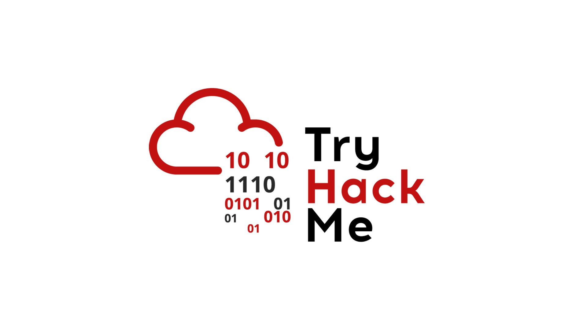

# Welcome(欢迎)

<figure><picture><source srcset=".gitbook/assets/Snipaste_2025-01-05_22-29-34-modified.png" media="(prefers-color-scheme: dark)"></picture><figcaption></figcaption></figure>

本项目GitHub链接：[https://github.com/Cybersecurity-Self-Learning/Learning-TryHackMe-CN](https://github.com/Cybersecurity-Self-Learning/Learning-TryHackMe-CN)

<figure><figcaption></figcaption></figure>

**TryHackMe** 是面向网络安全初学者的 **互动式学习平台**，以趣味性、低门槛和实战导向著称，适合从零起步构建渗透测试与防御技能。

#### **核心特点**

1. **游戏化学习**：通过“房间（Rooms）”形式分步学习，每个房间聚焦一个主题（如基础工具使用、漏洞利用）。
2. **实战靶场**：提供在线的渗透测试环境（如 Kali Linux 虚拟机集成），支持实时攻击演练。
3. 结构化路径：预设了多个学习路径，涵盖 Web 安全、网络攻防、逆向工程等。
4. 社区与协作：支持多人对抗，内置讨论区与积分排行榜。

#### **适合人群**

* 从零开始的网络安全爱好者：无需前置知识，提供了与基础渗透测试工具（如 Nmap、Burp Suite）相关的入门教程。
* 网络安全证书备考者：可针对性训练 OSCP 等认证考点。
* 网络安全教育者：支持创建学习班级，可跟踪学生课程学习进度。

**访问链接**：[TryHackMe](https://tryhackme.com/)（部分免费，高级内容需订阅）。

**总结**：TryHackMe以游戏化的方式降低了网络安全相关知识的学习门槛，适合零基础的学习者快速上手，兼顾趣味性与实用性。
